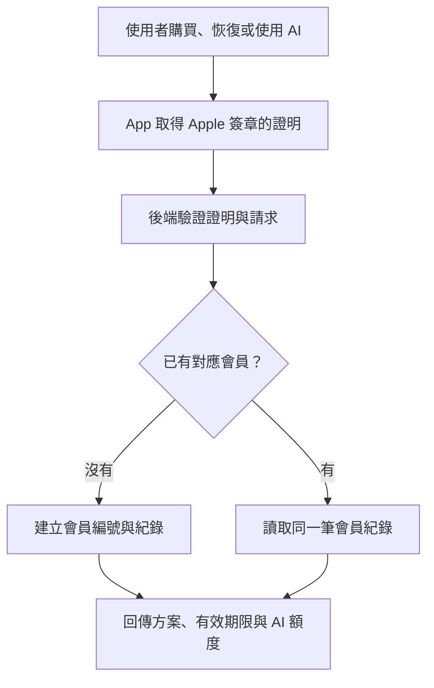

# 免註冊會員與 Apple 付款流程 / Membership and Apple payments

2026-09-21 發布準備更新：iOS 與 Node 會員實作已完成本機／測試接線；使用者已授權
正式會員服務及 TestFlight 上傳。正式雙環境 Cloud Run 已部署（首個 revision
`rainyclock-membership-00001-qtn`），Release 原始碼已填入正式服務網址，另有台灣
`membership-production` 與 `membership-testflight` Firestore Standard 資料庫。
**部署／上傳不代表正式收費已通過驗收或 App Review。** 使用者已在 iPhone 16 Pro
確認真實 Apple Sandbox 的美國買斷與台灣月訂閱；TestFlight production App Attest、
AI 完整生成／下載、S2S 廣告與其他驗收請依最新
[測試環境紀錄](MEMBERSHIP-STAGING.md)、[iOS Status](STATUS-IOS.md) 逐項確認。

本文件前半部為現行規則及程式行為，後半部明確標記歷史快照，歷史的「未部署」、
舊價目與待確認事項不能覆蓋最新決策。後端設定細節見
[操作說明](../weather-proxy/membership/README.md)。

> 1.7.0 不公開颱風／天災臨時放假：設定、狀態、方案文案及排程均不使用此功能。
> 功能原始碼與歷史紀錄留待 1.8.0；其買斷資格尚未定案，不列入 1.7.0 售價權益。

## 最新方案目錄 — 2026-09-21

| 商店 | 月訂閱 | 非消耗型買斷 |
| --- | --- | --- |
| 美國 | US$1／月 | US$10 一次 |
| 台灣 | NT$10／月 | NT$100 一次 |

不再提供年訂閱優惠方案。9/21 後續最新權益：**月訂閱與買斷都包含移除 banner、日曆
與每日一次免看廣告 AI 生成**。買斷永久持有目前這些權益、會員顯示優先於月訂閱，
已有有效買斷時不再提供重複月訂閱購買。同時持有的 Apple 訂閱仍呈現真實狀態與管理
入口，不代為取消；訂閱到期而買斷仍有效時，日曆繼續可用。每日 AI 共用一次、額外
一次廣告換一次生成、免費初始一次均未改。1.8.0 臨時放假是否包含於買斷未於本次決定。
台灣價格獨立指定，其他地區價格未定；App 使用 StoreKit 當地價格，不自行換匯。
會員頁、回前景及 Apple 付款／恢復購買返回時重載商品，抓取前後商店與商品幣別需一致；
價格不可用時只提供價格重試，不清除會員權益。21:19 的 TestFlight 實機曾出現卡片 USD、
原生付款 TWD；Apple 記錄的 TestFlight Storefront metadata 問題可能相關，不能由 API
回報 USA 推定付款帳號地區，亦不能保證重載可解決系統問題。見 [驗收紀錄](1.7.0-RELEASE-READINESS.md)。
build 34 增加已驗證 Sandbox／本機測試限定的「檢查測試商店價格」，並列既有 SK2 卡片
商品及另一套 Apple SK1 商店／商品回傳結果。這是只讀診斷，不購買、不改會員權益，
不把舊 API 接成價格備援，也不把本機成功當作 TestFlight 問題已解決。
22:05 已收到 build 34／iOS 26.6.2 真機結果：SK1、SK2 均回傳 USA／USD，原生
月訂閱付款確認為 NT$10；因此 SK1 不能解決本次差異。診斷已完成，顯示問題仍未解；
未以語言／GPS／固定台幣覆寫價格，也未決定隱藏價格。正式 App Store 行為尚未驗證。
9/21 ASC 已保存並重讀核對此表價格；月訂閱與買斷僅供應美國＋台灣共 2 地區，
未來自動供應 OFF。年方案已停止銷售且供應為 0 地區。買斷以美國 US$10 為新基準，
台灣另設手動 NT$100；其他未供應地區的 Apple 自動價格不算已定案售價。
本次買斷日曆已更新獨立 Sandbox `00004-kkd`，ASC 買斷中英說明也已保存並讀回；
完整證據見 [測試環境紀錄](MEMBERSHIP-STAGING.md)，未送審或正式上架。
年方案舊交易仍依 Apple 驗證後的狀態處理，停售不等於撤銷已購權益。

## 實作現況

- 專用 Sandbox scheme 使用 `Debug Sandbox` 安裝組態，從手機桌面重新啟動仍保留測試
  端點、獨立 keychain 與廣告停用。一般／Release 不受影響，Archive 仍用 Release。
  切換商店會重載當地商品；換 Apple 帳號則須明確同步會員以取得新的已驗證身份。
- 9/21 晚間會員頁改為月訂閱在前（英文 Monthly subscription）、買斷在後。操作入口收進
  右上角「⋯」，恢復購買／管理訂閱／刪除會員仍提供；有效訂閱顯示效期與續訂狀態，
  點 Auto-renewal 進 Apple 管理頁。Debug Sandbox 有限定沙盒交易的買斷退款入口，
  等 Apple 已驗證撤銷交易／REFUND 確認才移除權益。
- iOS `MembershipManager/Client/Security/Models`：StoreKit 2 購買、待批准／取消／失敗、
  恢復、交易更新、管理訂閱；Apple `AppTransaction` 證明搭配 App Attest 一次性請求。
  `appTransactionID` 在現行 SDK 有 back-deployment，iOS 17 可用；若返回空值仍拒絕，
  不以裝置 UUID 冒充會員。換機認回必須使用相同「媒體與購買項目」Apple 帳號。
- 後端 `weather-proxy/membership/`：Firestore transaction 儲存會員、購買、跨裝置額度、
  工作階段及已驗證獎勵；Apple 官方 Server Library 驗證 JWS、Server API 對帳、
  Notifications V2 去重。正式入口的 Production／Sandbox 使用不同 Firestore database、namespace 與 HMAC 身分密鑰，拒絕 Xcode 簽章。
- 每個會員每天一筆共用視窗；並行先保留額度，成功音訊與扣款同一 transaction。
  同 request ID 重試只取原結果；失敗釋回同一來源，程式中斷後 5 分鐘回收保留額度。
  音訊結果最多 480 KB、可取回 24 小時；超時不默默重做，需使用者確認新生成。
- LevelPlay 使用官方 S2S 的 MD5 驗證及 event ID 去重，不使用 AdMob。SDK 初始化
  user ID 由伺服器配發；未簽章的 dynamic/custom 欄位不決定歸屬。手機回報只觸發查詢。
  App Store 帳號更換後，若 LevelPlay 已用舊 ID 初始化，須重啟 App 才能繼續獎勵廣告。
- 「設定 → 其他 → 會員與方案」提供方案、本地價格、狀態、恢復／管理／刪除入口。
  最新目錄為月訂閱與非消耗型買斷；年方案不再販售，歷史交易仍保留驗證相容。
  價格取 StoreKit，不硬寫換算金額。
- 已購買方案按鈕停用並顯示狀態，訂閱同時顯示效期。上方顯示目前方案、自動續訂與
  下期方案（若不同）；點自動續訂列進 Apple 管理頁，不用本機開關假裝更改 Apple 偏好。
  返回管理頁、回到前景及 StoreKit 訂閱狀態事件均會重新查詢。取消續訂保留當期權益。
  `subscriptionProductId / subscriptionAutoRenews / subscriptionRenewalProductId` 為可選欄位；
  舊快取仍可讀取，未知續訂狀態顯示待確認，不推測為關閉。伺服器只採已驗證 Apple
  資料，續訂簽章時間獨立合併，避免舊通知或只有交易資訊的更新覆蓋新偏好。
- UI 及排程使用權益；移除 banner 不等於移除獎勵廣告。依 9/21 最新規則，日曆由有效
  訂閱或有效買斷解鎖；臨時放假維持 1.8.0 延後，其未來買斷資格本次不決定。
  使用 effective settings 副本，保留原設定；離線不清鬧鐘、失敗不刪既有排程。
- 刪會員會先停止存取，再清資料；中斷留待刪標記，由維護工作重試。Apple 訂閱仍需
  自行從「管理訂閱」取消。手機完成音檔與鬧鐘設定保留，待完成生成紀錄會清除。
  隱私政策與 privacy manifest 的本機檔案已同步更新；公開網站是否完成發布須另核對，
  不以改檔當作已公開。

## 已確認規則

1. 依使用者所在地午夜重置；未用不累積。伺服器時間決定日界，所有裝置共用會員時區。
2. 買斷＋訂閱共用每日一次；買斷會員優先顯示，訂閱到期保留有效買斷的 banner、日曆及每日 AI。
3. 生成成功且可靠保存才扣次；失敗退回原額度／廣告獎勵，重下載不扣。
4. 到期保留設定／既有排程；確認已無日曆權益後，下一次安全重排使用基本規則。
   仍有有效買斷時不移除日曆權益；保留真實 Apple 訂閱管理，不自動取消訂閱。
5. 免費方案初始 1 次，非每日；兩種鈴聲共用額度，播放、試聽或套用已存音檔不扣次。
   本機舊已用計數及廣告獎勵仍保留；舊版本機剩餘按 max(1 − 已用, 0) 計算。
6. 9/21 最新遷移決策：每個符合遷移條件的舊會員，由後端固定提供一次生成，不按手機
   申報的免費或廣告數量補發。切換時間以伺服器 migration cutover 設定與 Apple 已驗證
   original purchase date 判斷；既有 migration-pending 會員的固定補發只處理一次。
   本機廣告 claim 保留待核對，不直接入帳。刪除後重新建立、重裝及換機都不重複發放。
   新會員仍是初始一次；已使用／預留的後端 ledger 不歸零。

時區由 App 的 IANA 設定提出，不取得定位來驗證地理所在地。為防止切換時區多領，
新時區要等舊視窗結束，且每 24 小時至多生效一次；正常同時區的午夜及夏令時間照常。

## 正式與 TestFlight 的接線

- 正式 Release 連 `https://rainyclock-membership-510427696731.asia-east1.run.app`。
  Apple 驗證的 Production 對應 `membership-production`；TestFlight 的 Sandbox 購買
  對應 `membership-testflight`。兩者都要求 **production App Attest**。
- `X-RC-Apple-Environment` 僅為不可信路由提示。缺漏／未知值拒絕；選到任一環境後
  仍完整查核 Apple 簽章環境、App、商品、App Attest 與工作階段。改 header 不會把
  Sandbox 購買變成正式權益。iOS 的 Keychain／App Attest 狀態也依環境隔離。
- 舊 `RainyClock Membership Sandbox` scheme 仍用 `Debug Sandbox`、StoreKit None，
  連獨立 development App Attest 測試服務。此資料庫與 TestFlight 亦不同；Apple 可
  驗證購買仍可對帳，測試每日用量不宣稱會在這兩套測試資料庫共用。
- Apple V2 通知分 `/v1/membership/apple/notifications/production` 與 `/sandbox`。
  Sandbox payload 先驗簽，才轉送至明確允許的舊 Debug Sandbox 通知 URL；傳送失敗
  回可重試狀態，不靜默忽略，兩側各自去重。正式通知不轉送到舊測試服務。
- LevelPlay 共用 callback 先驗證官方簽章，再依已簽署的 reward user ID 查找唯一歸屬。
  找不到、跨庫重複或查核失敗均不發額度；不採 client 自填的環境或 member ID。
- TestFlight／Sandbox 的廣告流量停用。這不能當作正式獎勵廣告實測通過；平台驗收須
  用官方測試方式，另外驗證簽章、去重、入帳、失敗保留及領取後生成。

## 資料揭露、保留與刪除

「免註冊」不等於完全匿名。Apple 識別及內部會員編號能將購買與用量連回同一會員；
manifest 的相關類別標記 linked=true。手機不收信用卡、Apple 密碼或註冊 Email。
資料庫由後端存取，資料庫區域是台灣；不承諾 Apple／Google AI／LevelPlay 所有
處理也都在台灣。1.7.0 不向使用者提供天災臨時放假。

| 資料 | 實際用途與保留 |
| --- | --- |
| 會員、Apple 購買及裝置綁定 | 身分、權益與防重放；會員存在期間保留，刪會員清除可刪明細 |
| 時區、每日額度、生成 job／input HMAC、獎勵紀錄 | 跨裝置額度及重試去重；會員存在期間保留 |
| 輸入原文 | 送 Vertex AI 做語氣分類、Cloud TTS 生成；會員資料庫／應用程式日誌不保存原文 |
| 生成音訊與語氣結果 | Firestore 成功保存起 24 小時內可下載；到期即拒絕取回，TTL 實體刪除可稍後完成 |
| 本機文字、設定與已完成音檔 | 保留在手機，與刪會員／恢復購買分開；不是雲端同步功能 |
| 工作階段、challenge 與 replay guards | 按各自期限拒絕使用，再由資料庫 TTL 清理 |
| 主機 request diagnostics | Cloud Run 預設請求紀錄可含 IP、路徑、時間、HTTP 狀態及耗時；依雲端 logging 設定保留，不作廣告輪廓 |
| 刪除後的最少防重紀錄 | identity／purchase ownership／reward event 與 proof 的 HMAC、當日 quota guard 及刪除標記；目前沒有自動 TTL，不含原文／音訊／卡號 |

HMAC 防重紀錄仍能辨認回來的同一 Apple 身分，**不可說成不可連結或完全匿名**。
目前未設定自動期限是程式事實，不代表已批准無限保留、或已取得法律合規判定。
正式公開前需核定必要性、範圍、期限與適用的刪除義務；Apple 官方刪帳指引要求刪除
沒有依法保留必要的相關個人資料，不能僅憑「防濫用」字眼斷言已合規。

刪除入口為「設定 → 其他 → 會員與方案 → ⋯ → 刪除會員資料」。先撤銷存取，再清除
會員明細、購買 rows、auth 綁定、用量及伺服器音訊；中斷由維護作業重試。
**刪會員不取消 Apple 訂閱**，管理訂閱仍進 Apple 頁面；可立即刪除，不要求等到期。
之後明確同步／恢復才可重建，初始／遷移補發不重領，當日已用額度不重置。

## 發布前仍須逐項確認

- 本機／emulator 測試不替代 TestFlight 的 production App Attest、恢復購買、換機、
  退款／到期、跨裝置並行、AI 音檔完成下載及正式 LevelPlay callback 驗收。
  雲端 TEST 通知只證明通知投遞與驗簽，不能替代購買或退款事件。
- 正式服務部署、TTL、刪除維護排程、最小 IAM、TTS 成本限制與金鑰掛載須以部署紀錄
  及 readiness 結果核對。舊匿名語音端點是否仍開啟、哪些版本仍依賴它也需單獨說明；
  會員路徑不繞回舊端點，但不能據此宣稱整個舊服務已杜絕繞過額度。
- `docs/privacy-policy.html` 本次更新包含中英會員、付款、S2S、AI 保留與刪除揭露。
  9/21 本次核對時，公開 `https://shukaihu.github.io/RainyClock/privacy-policy.html`
  仍是 8/31 舊版；要發布最新檔案並重讀確認，不能只改本機。
- App Store Connect 的隱私標籤需同步更新：會員／裝置 ID、購買、使用互動、文字／
  音訊、廣告獎勵及診斷資料；並合併 Unity／LevelPlay 等第三方實際行為。
  App 自有 manifest 不會自動更新 ASC 問卷，也不能以 tracking=false 推論整個廣告
  SDK 不追蹤。本次只將第一方非廣告用途的診斷列入 manifest，未代改 ASC 問卷。
- 已核對 `MembershipView` 有公開隱私政策 URL 與 Apple 標準 EULA
  `https://www.apple.com/legal/internet-services/itunes/dev/stdeula/`，也有自動續訂、
  本地價格與恢復購買範圍說明。ASC 版本 metadata／訂閱及買斷審查附件仍須另核對。
- 刪除後最少防重紀錄的保留政策仍需上述審查；不要把明確披露誤當成法律合規保證。

## 歷史啟用盤點（9/16 至 9/21 19:22；不是現行待辦清單）

以下原文保留時間脈絡。其「正式未部署」、「月訂閱未測」與舊價目，已由本文件開頭
及最新 STATUS／STAGING 紀錄取代；請勿引用此段推翻後續的服務部署與真機購買證據。

- App Store Connect「商務 → 協議」需完成 Paid Apps Agreement、銀行帳戶及稅務資訊。
  2026-09-16 後續使用者提交後的截圖顯示：台灣稅務表格、美國外國受益人證明、
  W-8BEN 均「已完成」。同日稍後實際讀取 ASC，銀行已「使用中」、付費 App 協議
  已「有效」。DSA 上一次截圖仍是「審查中」，本輪未重新查核其狀態。
  協議必須 Active 才能測 Sandbox IAP；上傳 build 不表示商品已開放購買或可收款。
  台灣個人帳戶填本人銀行帳號、銀行留存的戶名與地址、主要幣別、帳戶類型及銀行／
  分行代碼，依 ASC 欄位與銀行提供的資料填寫，不預設 SWIFT 等於 Taiwanese Bank Code。
  非美國開發者也需按 ASC 問卷完成適用的美國稅務表格；本輪協助填寫一般欄位，
  美國稅號、法律聲明及最終提交由使用者自行完成。不在專案記錄個人稅號等資料。
- 一般／Release 的 `MembershipServiceURL` 留空，正式會員未開放；僅獨立 Sandbox 後端
  設 `MEMBERSHIP_ENABLED=1`，Debug 專用 scheme 連測試網址且停用廣告。一般版本的
  免費初始一次／本機廣告流程保留；未改 Android，會員生成不回落到舊匿名端點。
- 使用者授權後已啟用 Firestore API，盤點沒有既有 DB，再建立獨立 `membership-sandbox`
  Standard／Native／asia-east1；專用 Cloud Run／IAM／Secret／deny-all rules 與 TTL 已配置。
  測試 revision `rainyclock-membership-sandbox-00004-kkd` 已更新買斷日曆權益並啟用，`TTS_DISABLED=1`；
  正式會員資料庫尚未建立，原天氣 revision `00012-win` 未改。
- 官方 Apple roots 與 App Store Server API key／issuer 已接入；私鑰保存於 repo 外及
  `membership-sandbox-apple-iap` v1。`RainyClock Membership Sandbox` 只是金鑰名稱，
  Sandbox 限制由後端環境實施。真實 Sandbox `getNotificationHistory` 最初認證成功、歷史為空。
  ASC Sandbox 通知網址已保存，正式通知 URL 空白；等待設定傳播後，15:27:51Z 請求的
  Apple TEST 通知已送達，15:28:28Z 查詢為 `SUCCESS`。官方 `SignedDataVerifier` 加上
  線上憑證檢查已驗證 Sandbox／本 App／TEST，Cloud Run 對應 POST 為 200，
  TEST 通知串接已通過；先前四次 `4040007` 已解除。
  TEST 不代表 IAP 購買或額度入帳；App Attest、購買／認回及實際交易通知仍待真機端到端驗證。
- 9/21 使用者最新確認及截圖中的兩列證實台灣、美國 Sandbox 帳號皆已建立。
  頁面標題／總數與兩列不一致，不以該數字否定建立結果；測試憑證由使用者自行持有。
  仍需手機登入與真實購買驗收，不能將帳號建立視為端到端成功。
- 9/16 歷史設定（價格／年方案與買斷不含日曆文案已被 9/21 決策取代）：ASC 從零商品新增月、年與非消耗型買斷草稿。月／年同屬 `RainyClock Plus`
  （群組 ID `22390056`），週期為 1 個月／1 年，均已設為 level 1；商品與 Apple ID
  見 [測試環境紀錄](MEMBERSHIP-STAGING.md)。UI「準備提交」，均未提交或發布。
  當時使用者批准僅美國 Sandbox 測試；三商品儲存月 US$1／年 US$10／買斷 US$5，
  USA only，未來新地區自動開放 OFF。年方案為預付 1 年，未設 12 個月承諾逐月付款。
  Apple 自動產生的非美國對應價不是已批准正式售價，其他地區均不可售。
  英文／繁中六筆商品與兩筆群組本地化已儲存並重讀核對；群組 `RainyClock Plus`、
  使用 App 名稱 `Rainy Clock`。審查截圖尚未提供，家庭共享關閉。
  真機 `Product.products` 與購買未測。9/21 新目錄的實際 ASC 改價與地區供應核對另記於 staging；
  不能以舊設定或最新價格決策推論已發布或實際認回已通過。
- LevelPlay private key、S2S callback URL、初始化 user ID 與每次 reward=1 的平台設定
  待完成。只執行本機簽章測試，尚未跑實際 dashboard Test callback／真機 Test Suite；
  模擬器及新的真機 Sandbox scheme 均禁用廣告 SDK，未產生正式廣告流量。
- 舊額度沒有可信伺服器紀錄；App 保留原數字並可申報一次遷移 claim，後端先標記待查核，
  不視為可花用額度。正式遷移決策與匿名 `/v1/tts` 切換尚未完成；公開端點仍存在時，
  不能宣稱整個服務已杜絕繞過每日額度。`LEGACY_TTS_DISABLED=1` 可關閉舊端點，但會
  影響仍使用它的客戶端，須先處理相容與遷移；本次没有切換。
- 測試 DB 的 TTL／最小 IAM 已部署；正式版仍需自己的設定。刪除維護 Cloud Run Job／IAM
  排程、成本／異常告警均待完成。保留防重摘要的期限及法規依據尚需審定，不能將實作當作法律意見。
- 全新、從未 IAP 的 Sandbox 帳號仍要實測 transaction history `200` 空集合；上述
  notification history 空集合不等於會員交易歷史已驗證。官方未保證
  `4040010` 可解釋為免費帳號。目前該錯誤不發 session，因此會阻擋首次免費使用及
  購買前同步，須在平台測試中確認，不能以吞錯誤的方式宣稱認證成功。
- 已有轉送標頭 IP 限流只作輔助，正式入口需配置可信代理／雲端限流。
- 本機 StoreKit 測試與密碼學 fixture 不是 App Store Sandbox／正式帳號驗證成功。

## 測試與重現

使用 Xcode scheme `RainyClock Membership Local` 可在 Simulator 預覽方案並使用
`Configuration/RainyClockMembership.storekit` 模擬購買；不會扣錢或取得正式 AI 次數。
正常 scheme 不套用測試商品。`MembershipStoreKitTests` 用 Apple 的本機 StoreKit 服務，
測試要 serial 執行，因為 StoreKit test environment 共用狀態。
早期本機批次的 iOS 26.2 完整 232 項測試通過，未簽署 iOS Release 建置通過；本機方案頁也已
以 Simulator 檢查。iOS 26.5 的 StoreKit service 配置錯誤另記錄於 Status。
該批次後端 134 項通過、無跳過，包含 Firestore Emulator、密碼學驗證與廣告雙重去重。
較新的 Sandbox 建置／151 項後端測試、HTTP 與 Apple API 結果見 [測試環境紀錄](MEMBERSHIP-STAGING.md)。
後端 emulator 啟動與命令見 [後端操作說明](../weather-proxy/membership/README.md)。
測試結果與剩餘真機／平台工作記錄在 [iOS Status](STATUS-IOS.md)。

## 查核來源

- [Apple IAP 設定與付費協議要求](https://developer.apple.com/help/app-store-connect/configure-in-app-purchase-settings/overview-for-configuring-in-app-purchases)、
  [銀行資訊（含台灣代碼）](https://developer.apple.com/tw/help/app-store-connect/manage-banking-information/enter-banking-information)、
  [稅務資訊](https://developer.apple.com/help/app-store-connect/manage-tax-information/provide-tax-information)：2026-09-16 查核。
- [Apple appTransactionID](https://developer.apple.com/documentation/storekit/apptransaction/apptransactionid)
  與 [WWDC25 StoreKit](https://developer.apple.com/videos/play/wwdc2025/241/)：穩定帳號／App 對應與 back-deployment。
- [Apple deviceVerificationID](https://developer.apple.com/documentation/storekit/appstore/deviceverificationid)：
  nonce 與 device ID 的 SHA-384 驗證；它不是獨立的身分密碼。
- [Server transaction history](https://developer.apple.com/documentation/appstoreserverapi/get-transaction-history)
  與 [4040010](https://developer.apple.com/documentation/appstoreserverapi/transactionidnotfounderror)：
  無法查核時不當作已付款或成功空歷史。
- [LevelPlay S2S](https://docs.unity.com/en-us/grow/levelplay/platform/settings/server-to-server-callback)：
  簽章、ack 與重試；[iOS rewarded integration](https://docs.unity.com/en-us/grow/levelplay/sdk/ios/rewarded-ads-integration)。
- [Apple 帳號刪除](https://developer.apple.com/support/offering-account-deletion-in-your-app/)：自動建立
  的會員也須提供刪除入口；刪除與取消訂閱分開。此 App 已加入口，外部發布仍待處理。

## 原設計背景（以下以新版實作及已確認規則為準）

## 使用者體驗

建議第一版使用「免註冊、以系統編號識別的會員紀錄」。基本鬧鐘不因會員服務暫時
無法連線而停止使用；需要購買、恢復權益或使用需要額度的 AI 服務時，執行身分同步。
這不需要雨天鬧鐘的 Email／密碼表單，也不需要先加「使用 Apple 登入」按鈕。
Apple 帳號登入或付款驗證仍可能由系統要求，不能承諾永遠完全沒有驗證畫面。

「自動建立」指我們寫程式，在驗證成功後建立資料；Apple 不會替雨天鬧鐘建立或代管
這份會員資料庫。這種持續識別的紀錄也不是完全匿名資料，正式導入時要同步更新隱私
政策和 App Store 隱私揭露。

## 身分與驗證

- Apple 的 `appTransactionID` 是同一 Apple 帳號在同一 App 的穩定識別碼；重新下載、
  換裝置、退款、再次購買或換商店不會改變。每位家庭共享成員有自己的識別碼。
- 後端使用 Apple 簽章的 App／購買交易資料建立對應；會員本身使用獨立的內部 ID，
  方便日後綁定自建登入或 Android 身分。測試與正式環境隔離。
- 識別碼只是查找用的編號，不能當作密碼或授權憑證。後端必須驗證簽章、App、環境、
  商品及適用的交易狀態。付費判斷不能只相信手機送來的「已購買」布林值。
- 會員請求另需安全的工作階段與裝置／請求驗證；App Attest 的一次性 challenge 和
  assertions 可降低偽造 App 與重放請求的風險。App Attest 證明的是 App 執行個體，
  不等於訂閱有效或使用者身分證明；不能取代 StoreKit 交易驗證。
- App Store 帳號切換時重新驗證對應，避免沿用前一帳號的工作階段和額度。跨平台
  共用會員需另外綁定，不能假設 Apple 識別碼也代表 Google Play 使用者。

## 後端要保存的資料

採 Cloud Firestore Standard，建議選與既有 Cloud Run 相同的台灣 asia-east1 區域，
放在使用者自己的 Google Cloud 專案；不依賴開發電腦持續開機。由後端透過服務帳號
讀寫，不能讓手機直接任意修改購買權益或每日額度。此會員資料庫不包含鬧鐘設定或
音檔的跨裝置同步；那是另一項功能。

| 類別 | 內容 |
| --- | --- |
| 會員 | 內部 ID、客服編號、已驗證的 Apple 識別對應 |
| 購買 | 商品、交易與原始交易 ID、訂閱有效期限、續訂／退款狀態 |
| 權益 | banner 移除、日曆、臨時放假、每日內含 AI 資格；由已驗證購買推導 |
| AI 用量 | 會員、服務日期、使用與預留紀錄、生成請求 ID、完成結果 |
| 廣告獎勵 | 每次獎勵的唯一紀錄、已驗證狀態、是否已使用 |
| 工作階段 | 已驗證裝置／session、到期與撤銷資訊 |

會員資料庫不需要信用卡卡號、Apple 帳號密碼、住家／公司地址或鬧鐘時間。
姓名與 Email 不是這個方案識別付費者的必要欄位。

## 購買、續訂與每日 AI

1. 使用者選月訂閱或非消耗型買斷，價格依上方 9/21 最新目錄；App 透過 StoreKit 顯示
   Apple 系統購買畫面，以商店實際提供的本地化價格為準，不提供年方案。
2. 購買完成後，App 提供簽章交易給後端；後端驗證並可靠記錄後，更新會員權益。
   尚待批准或付款失敗不等於成功解鎖；重試同一交易不能重複發放。
3. Apple Server Notifications V2 通知續訂、到期、退款等變化；後端還需用 Server API
   對帳最新狀態，處理重複、延遲或漏接事件。使用者關閉自動續訂不等於立即失去
   已付款期間的權益；退款與撤銷需依 Apple 最新狀態處理。
4. AI 請求先由後端判斷會員權益及每日剩餘量；並行請求必須以資料庫交易防止多扣或
   多送。同一生成請求的重試應取回原結果，不重複生成／扣額度。完成、失败、結果保存
   與重試的處理需要一起設計，不能僅由手機自己宣告生成失敗來無限制退款額度。
5. 額度用完可自願看獎勵廣告。後端應使用廣告平台可驗證的獎勵事件並去除重複；
   現有本機 `grantCredit()` 不能直接當作正式後端獎勵依據。平台回呼的實際配置待查核。
6. 換裝置或重新安裝後，在相同 App Store 帳號驗證／恢復，再查回同一會員與用量。
   手機設定和已生成音檔的跨裝置備份是另外的功能，不隨購買恢复自動完成。

每日更新、重疊權益、失敗返還與到期規則已於本次實作中由使用者確認，見上方「已確認規則」。

## 使用者付款與信用卡

採用 Apple App 內購買（StoreKit）。付款畫面由 Apple 提供，使用者依設定用 Face ID、
Touch ID 或 Apple 帳號密碼等方式確認。Apple 依帳號登記及所在地支援的付款方式扣款。
App Store 內購與直接串接 Apple Pay 是不同的開發介面；我們在這個方案串接 StoreKit。

Apple 官方台灣付款方式列表包含 Apple 帳號餘額、Apple Pay、街口支付、部分電信
帳單代付及多數信用卡／簽帳金融卡，實際可用性仍依 Apple 帳號與付款條件。
已設定可用付款方式的使用者通常不用再填卡號；未設定或付款失敗時，由 Apple 的
系統流程要求新增或更新。雨天鬧鐘不建立信用卡輸入頁、不處理或保存卡號。

## 對照現有專案

實作前只有 Cloud Run 上的 Node 語音／天氣服務，當時沒有會員資料庫、StoreKit 驗證或
伺服器端的會員每日額度。iOS `AIVoiceQuota` 仍只在 Keychain／UserDefaults 記數。
需要新增的實作為：iOS 身分與購買同步、後端驗證／工作階段、持久會員與用量資料、
Apple 訂閱事件處理、廣告獎勵驗證，以及會員狀態／恢復購買／管理訂閱的介面。
目前沒有必要為這個流程新增自建信用卡金流。

## 官方來源

- [Apple appTransactionID](https://developer.apple.com/documentation/storekit/apptransaction/apptransactionid)
- [StoreKit In-App Purchase](https://developer.apple.com/documentation/storekit/in-app-purchase)
- [App Store Server API](https://developer.apple.com/documentation/appstoreserverapi)
- [App Attest 伺服器驗證](https://developer.apple.com/documentation/devicecheck/validating-apps-that-connect-to-your-server)
- [Apple 內購結帳與付款](https://developer.apple.com/in-app-purchase/)
- [Apple 帳號可用付款方式](https://support.apple.com/zh-tw/111741)
- [為 Apple 帳號加入付款方式](https://support.apple.com/zh-tw/118429)

## Current English handoff — September 21 release preparation

The production membership entrypoint has been deployed, and the Release source now points to it.
Production StoreKit and TestFlight Sandbox purchases are strictly separated by Firestore database,
namespace and identity HMAC secret; both require production App Attest. The older development
Sandbox remains independent. An environment header is only a routing hint, never authentication.
Device Sandbox lifetime and Taiwan monthly purchases have been confirmed; this does not certify
TestFlight, production purchases, refunds, AI delivery or live rewarded-ad verification.

Current products: US$1/month or US$10 lifetime; NT$10/month or NT$100 lifetime in Taiwan.
Both include banner removal, calendar and one shared daily AI generation. Additional generations
require a verified rewarded ad. Annual is off sale, historical valid transactions remain supported,
and temporary disaster closures are not public in 1.7.0. Lifetime outranks monthly in the displayed
plan without silently cancelling an Apple subscription. Free membership receives one initial
allowance, and each eligible legacy identity receives a fixed migration allowance of one only once;
unverified client ad-balance claims stay quarantined rather than increasing server credit.

The local privacy policy and manifest now disclose linked membership/purchase/usage/reward data,
24-hour server audio, pseudonymous retained anti-abuse digests, Cloud Run request diagnostics,
and the distinction between deletion and subscription cancellation. Input text is processed through
Vertex AI and Cloud TTS, not persisted in the membership Firestore database. Publishing the updated
policy, updating ASC privacy answers, establishing the minimal anti-abuse retention basis/period,
and completing distribution-signed end-to-end testing are separate release checks. See STATUS-IOS
and MEMBERSHIP-STAGING for timestamped deployment and test evidence.

## Historical English handoff (before the September 21 production deployment)

The following original snapshot is retained only as history; the current handoff above supersedes it.

Implemented with the normal app's production rollout still disabled: registration-free Apple-verified membership,
StoreKit 2 products and UI, Firestore transactions, App Attest/session validation, Apple Server API
reconciliation and Notifications V2, durable generation/quota accounting, signed LevelPlay rewards,
and member deletion. Approved rules: local-time midnight without rollover, one daily allowance
shared by overlapping lifetime/subscription purchases, charge only after durable success, preserve
settings and existing alarms until safe replanning after confirmed expiration. Lifetime benefits
survive subscription expiry. The latest September 21 decision adds calendar to lifetime, makes
lifetime the displayed plan when both are owned, and blocks redundant monthly purchase while it is
active. Preserve the real Apple subscription status and management entry; never silently cancel it.
Calendar only falls back after verified loss of both subscription and lifetime access. Free remains
one initial generation plus rewards; paid daily one is shared. Future disaster-closure eligibility
for lifetime is not decided. Sandbox revision 00004-kkd now includes the minimal calendar change,
and the English/Traditional Chinese ASC lifetime descriptions were saved and read back. Production
was not deployed; device end-to-end verification remains separate. See staging for evidence.

The isolated Google Cloud Sandbox is now enabled with public HTTPS invocation and application
Apple/App Attest/session authentication. Its real IAP key is secured outside the repo and in
Secret Manager; the key's name does not restrict it to Sandbox. The initial Apple Sandbox
notification-history query authenticated successfully. After configuration propagation, the 15:27:51Z
TEST request succeeded and the 15:28:28Z status reported SUCCESS. Apple's official verifier with
online certificate checks verified the real Sandbox payload for this app, and Cloud Run confirms
the matching POST returned 200. TEST notification integration passed; earlier 4040007 errors are
resolved. TEST does not prove an IAP purchase or create purchase/quota ledger entries.
The user's latest September 21 confirmation and screenshot show both Taiwan and US Sandbox
testers created (two visible rows). The inconsistent heading count does not override those rows
and the user's confirmation. Credentials stay with the user; device login/purchases remain unverified.
The September 21 catalog is monthly and non-consumable lifetime only: US$1/month and US$10 once;
NT$10/month and NT$100 once in Taiwan. Annual is no longer offered, but historical verified annual
transactions must retain compatibility. Taiwan prices are independent of US-generated equivalents.
The September 21 US/Taiwan prices are saved and read back in ASC, monthly/lifetime are available
only in those 2 territories, and annual is off sale in all territories. Future-territory expansion
is off. The US lifetime base-price adjustment recalculated Apple-managed equivalents, then Taiwan
was manually fixed at NT$100. Other unavailable territories' generated prices are not approved prices.
See staging for evidence; the September 16 three-plan prices are historical. Review screenshots
remain missing and family sharing is off. No products
have been submitted or released; real-device Product.products and purchases remain untested.
AI remains disabled. Device/App Attest, purchases, LevelPlay, and AI end-to-end verification remain
pending, along with production privacy, retention and legacy-credit migration work. The production
weather service and archived 1.7.0 (29) membership configuration are unchanged. See the staging record
and STATUS-IOS for exact evidence and remaining work.
